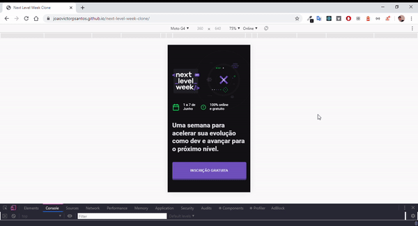
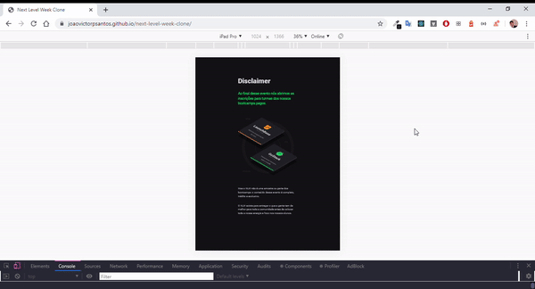
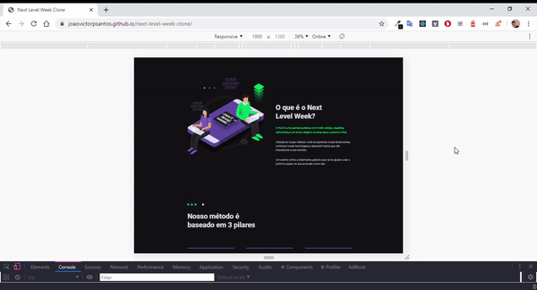

<h2 align="center">


<br/><br/>
Clone do site da Next Level Week:
<a href="https://joaovictorpsantos.github.io/next-level-week-clone/">https://joaovictorpsantos.github.io/next-level-week-clone/</a><br/><br/>

<br/>
<div style="display:flex">


</div>
<div style="display:flex">


</div>
</h2>

<blockquote align="center">
  Esse projeto é open-source, contribua você também :D
</blockquote>

<hr/>

## 💡 Sobre o projeto:

Desenvolvi esse projeto com o intuito de praticar e estudar mais sobre o ecossitema do React para construção de aplicações. Peguei essa landing page de início para poder replicar usando a biblioteca styled-components

## 🔥 O que aprendemos?

Através dessa aplicação pratiquei mais sobre:

- Uso do React
- Usar a biblioteca Styled Components para estilização
- Criação de aplicações responsivas
- Prática em criação de landing pages

## ⚙️ Techs:

- React
- Styled Components

## ⛏ Ferramentas:

- [Visual Studo Code](https://code.visualstudio.com/download)

## 🏁 Executar esse projeto:

Para executar esse projeto em sua máquina,
De o clone no repositório:

```bash
$ git clone https://github.com/joaovictorpsantos/next-level-week-clone.git
```

Execute esse comando na raiz do projeto para baixar as dependências:

```bash
yarn
```

Logo depois para executar execute:

```bash
yarn start
```

<br/>

<h4 align="center">
  Vamos compartilhar conhecimento e crescer juntos!!!
</h4>

<br/>

---

<h3 align="center">
Autor: <a alt="João Victor Pereira Santos" href="https://github.com/joaovictorpsantos">João Victor Pereira Santos</a>
</h3>

<p align="center">

  <a alt="João Victor Pereira Santos Linkedin" href="https://www.linkedin.com/in/joao-victor-pereira-santos//">
    </a>
  <a alt="João Victor Pereira Santos GitHub" href="https://github.com/joaovictorpsantos">
  </a>
 <a alt="João Victor Pereira Santos Twitter" href="https://twitter.com/_joaovictorps">
  </a>

</p>
